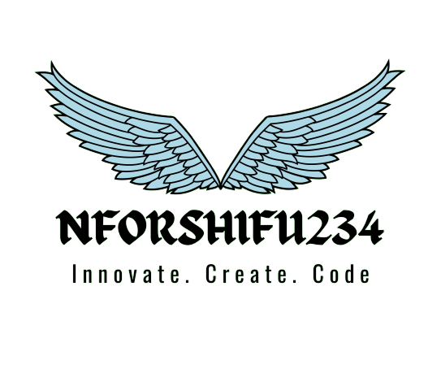

# My Vas2Nets Internship Repository

## Company Information

### Vas2Nets Technologies Limited

**About:**
Vas2Nets is a comprehensive service provider catering to the diverse needs of both individual and business customers. Specializing in mobile digital services and digital banking solutions, Vas2Nets utilizes cutting-edge technology, expert knowledge, industry licenses, and strategic relationships to deliver innovative and transformative services.

Our primary objective at Vas2Nets is to enhance the quality of life and boost business efficiency by providing services that are not only easier and safer but also more efficient. Renowned for our commitment to "giving smarter value," this philosophy is encapsulated in our tagline, reflecting our dedication to delivering value-added solutions to our clients.

In essence, Vas2Nets stands as a trusted one-stop shop, offering a wide array of services that leverage technology and expertise to meet the evolving needs of our customers.

**Operating Regions:**
- Nigeria
- Ghana
- Cameroon
- South Africa
- Canada

**Website:** [Vas2Nets](https://www.vas2nets.com)

## My Information

### Name: `NFORSHIFU234 Dev || Shifu-Nfor Nyuiring-yoh Rhagninyui`

**About Me:**
Brief description about yourself, your interests, and your goals during the internship.

**Contact:**
- **Email:** nforshifu234.dev@gmail.com
- **LinkedIn:** [NFORSHIFU234 Dev LinkedIn Profile](https://www.linkedin.com/in/nforshifu234dev)
- **GitHub:** [NFORSHIFU234 Dev Profile](https://github.com/nforshifu234dev)

## Repository Structure

Brief description of how the repository is organized, including folders, project names, and their purposes.

## Projects

List of projects completed during the internship with brief descriptions and links to their respective folders or documentation.

1.  
    [MiSchools](/mischools/)
    MiSchools, a project by NFORSHIFU234 Dev, is your a school enrollment system. Seamlessly register as a student, fire off inquiries via the contact form, and empower administrators to manage users and messages. With a robust login system, it's crafted using CodeIgniter, HTML, CSS, Bootstrap, and a dash of RestCountries API magic. Check out the [repository](/mischools/) for a closer look.
---

&copy; Jan - Jun 2024
